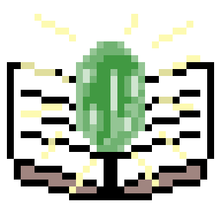

<p align="center">
  
</p>

# 💎EmeralEngine
EmeralEngineはWindows向けのノベルゲームエンジンです。

# 特徴
### 1.完全ノーコードでのゲーム制作が可能
シナリオだけに注力することができます。

### 2.軽量
サクサク動きます。

# 対応プラットフォーム
- Windows10, 11

# 導入について
以下の2つを導入する必要があります。

- .NET SDK
- EmeralEngine本体

# .NET SDKの導入

1. Windowsキー+Rキーを同時押し
2. cmdと入力しエンターキーを押す
3. 出てきたコマンドプロンプトに以下のコマンドを入力しエンターキーを押す。(冒頭の>は要りません)

```cmd
> winget install --id Microsoft.DotNet.SDK.9
```

4. `dotnet --version`と打ってバージョン情報が出てくることを確認する

もしwingetコマンドが無い場合は、[公式サイト](https://dotnet.microsoft.com/ja-jp/download)よりインストーラーをダウンロード、インストールしてください。
バージョンはWPFが扱えるなら何でも良いですが、推奨は9です。

## EmeralEngineの導入
1. [リリースページ](https://github.com/Emeral-Engine/EmeralEngine/releases/latest)より`EmeralEngine-dist.zip`をダウンロード
2. ダウンロードしたファイルを解凍

# 使い方
## プロジェクトの作成
解凍したものの中の`EmeralEngine.exe`をクリックすると、プロジェクトの選択画面が出てくると思います。
初回はまだプロジェクトが作成されてませんので、「新規」を押してプロジェクトを作りましょう。

名前とウィンドウサイズを決めて「作成」を押すと、プロジェクトの作成が始まります。

## スクリプトを書く
デフォルトでは、プロジェクトが作成されると2つサブウィンドウが出てきます。

この内の一つ、スクリプトエディターはスクリプトを記述するウィンドウです。

左がタイムライン、中央上が立ち絵設定、中央下がスクリプト、右上半分がメモ(本文に表示されません)、右下が各種ボタンとなっています。


## シーンを作る
最初に出てきた2つのウィンドウの内のもう一つはシーンエディターです。こちらではシーンの作成、削除、もしくはシーンに関する設定(背景、BGM、トランジション等)を行うことが出来ます。

このシーンという概念は、「BGMや背景が同じ一連のスクリプトをまとめる」為に存在しています。

逆に言えば、背景やBGMを変えたければ、新しくシーンを作成する必要があります。

## 実行
さて、上記2つだけでも色々とやることができると思います。ここで、どんな感じになるのか見てみましょう。

メインウィンドウの右上の「実行」というボタンをクリックすると、現在選択中のシーンからどんな感じになるのか、プレビューを見ることができます。

## メッセージウィンドウをデザインする
プレビューを見て分かりますが、デフォルトのメッセージウィンドウは少し無機質な感じがしますよね。

そんなときは自分でカスタマイズしましょう。

メニューバーの「表示」から「メッセージウィンドウデザイナー」をクリックしてください。

ここではメッセージウィンドウに関する各種設定を変更することができます。

## 全体の流れを決める
「シーン」の集まりのことを「エピソード」と言います。
実は皆さんがここまでで追加してきた「シーン」は、すべてある「エピソード」の中にあったのです。

「ストーリーエディター」では、そんな「エピソード」や「動画」をどの順に流すか決めることができます。

メニューバーの「表示」より「ストーリーエディター」を選択してください。ここでは「コンテンツ」という単位で「エピソード」、もしくは「動画」を流す流れを決めていきます。

## タイトル画面を作る
やっぱりタイトル画面は必要ですよね。

メニューバーの「表示」から「タイトル画面エディター」を選択してください。

ここではタイトル画面を編集する事ができます。

ボタンの種類は2種類あり、一つはデフォルト、もう一つはカスタムボタンです。

また、その他画像は自由に配置、リサイズできます。

## 出力
ある程度形になってきたら出力してみましょう。

メニューバーの「ファイル」、「出力」から「実行ファイル」をクリックしてください。

出力先のディレクトリを選択するとビルドが始まります。

# 独自概念について
さて、ここまで説明してきた「スクリプト」、「シーン」、「エピソード」、「コンテンツ」について、改めてまとめます。

### スクリプト
- 最小単位。
- セリフや立ち絵の情報を含みます。

### シーン
- スクリプトをまとめたもの。
- すべて背景やBGMが同じ。
- トランジションの情報を含みます

### エピソード
- シーンをまとめたもの

### コンテンツ
- 「エピソード」、もしくは「動画」のこと
- この単位を基準に、どの順にゲームを進めて行くかを決めます
- トランジションの情報を含みます

# 開発者向け
[README_DEVELOPERS.md](./README_DEVELOPERS.md)を参照してください。

ここには「生成物のコードを改変する方法」も含みます。

# アップデートについて
特別な操作は必要ありません。EmeralEngine本体を導入するのと同じ手順を踏んでください。

# バグ報告、及び機能要望について
[Issue](https://github.com/Emeral-Engine/EmeralEngine/issues)よりテンプレートに従いお願いします。
機能改善要望は「Feature request」と同じテンプレートを使ってください。
